## The SMC-NPU Algorithm
Note that SMC-GPU are designed for the SIMT programming model in GPU. The vector unit in Ascend NPU adopts the SIMD programming model.
#### 1. Motivation 
The NPUs are specifically designed for deep learning tasks. Compared to SIMD vectorized instruction sets on CPUs, the SIMD computation of the Ascend chip's vector processing unit has another notable characteristic: data reads and writes must be memory-contiguous or segment-contiguous, which poses significant programming challenges for general HPC tasks. Note that both CPUs and GPUs can gather and assemble non-contiguous scalar data, whereas the Ascend chip cannot.

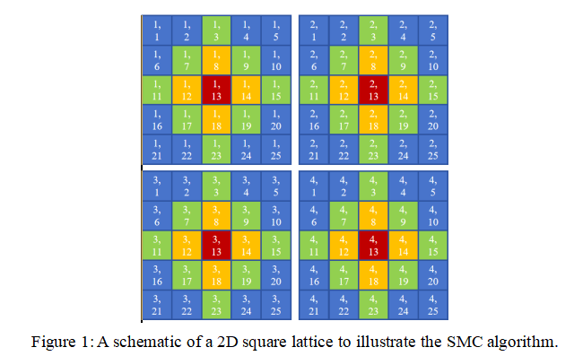

Specifically, Monte Carlo simulations generally exhibit random memory access patterns. For simplicity, we use a 2D square lattice for discussion, as shown in Fig.1. In an atom-swap trial in SMC, while the red atoms follow a regular pattern, their exchange neighbors (orange atoms) are randomly distributed in space. In CPU and GPU architectures, each red atom attempts to swap randomly with its nearest neighbor. Each CPU core or GPU thread executes identical exchange instructions while reading atom-specific data from different memory locations - an operation that poses little challenges for conventional architectures, but presents serious computational bottleneck for NPUs due to the abscence of real memory cache system.

To address the above problem, we propose the SMC-NPU algorithm, which is designed to unleash the computing power in NPU for MCMC atomistic simulation by **1) coalescing memory access pattern, as much as possible. 2) vectorize the scalar operations via masked operations. 3) Exploit local buffer to overcome the memory bandwidth wall**. We will explain the two optimization techniques in detail in the following.

#### 2. Memory Access Coalescing
In SMC-GPU, only one lattice are used, and all swap trials are attempted on-site. While such a practice saves memory space, it inevitablly introduces frequent read and write operations that demand irregular memory access, which is highly unfavorable for NPU.
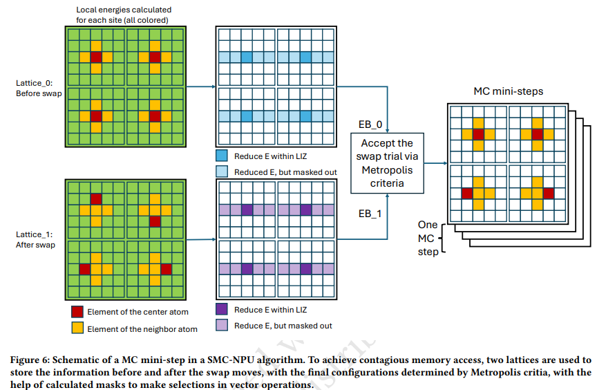
To coalescing the memory access, the SMC-NPU algorithm uses **two lattices** to record the atomic configuratoins before and after the swap trials, respectively, as shown in Fig. 6 of the manuscript. Note that the usage of of two lattices enables the **decoupling of the two important steps: energy calculation, and Metropolis updating**, as illustrated in Fig. 5. As a result, the most computing-intensive step, the calculation of the local energies for each sites, can be done in an **embarassively-parallel way, with contigious memory access**. While some overhead still exists due to the need to padding the neighbor vectors for the hardware's SIMD width, the contigious memory access pattern, as well as the huge parallel degrees introduced by SMC-NPU, can effectively utilize the large number (~40) of 2048-bit SIMD vector units in an NPU. Note that the lattice are stored as `INT16`, therefere a total of $128\times40=5120$ sites can be processed simultaneously in a clock cycle by a single  **TBD with Kai**. 
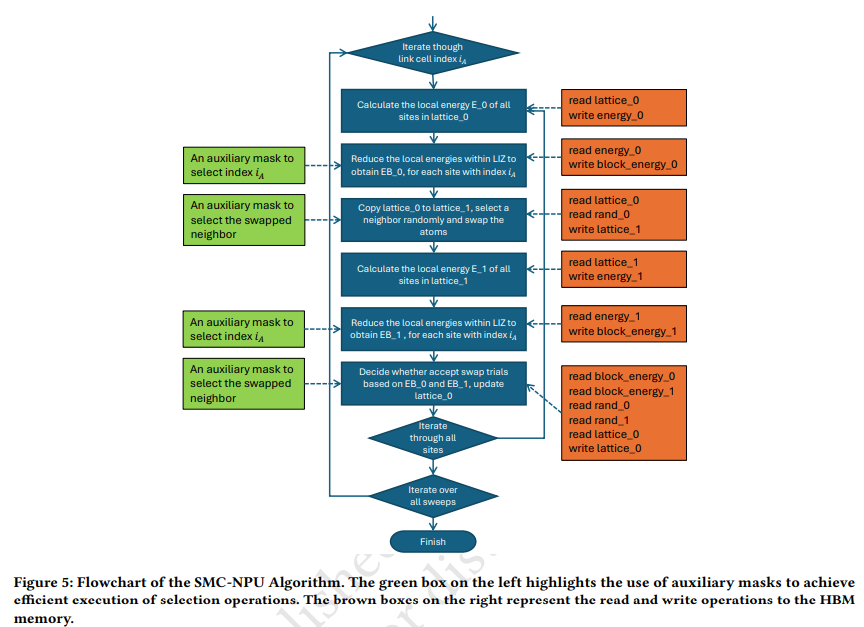
We highlight that, unlike the NPU-specific masked-operation technique to be discussed below, the above optimization technique in principle can be applied to any vector-based accelerators, in additional to NPUs, to convert irregular memory access in atomistic simulation to regular ones, at the cost of doubling the memory usage for storing the lattice.
#### Vectorization via Masked Operations
The vector processing unit supports a select operation, which performs an element-wise selection between two source operand vectors and stores the result in a destination vector. The selection is mask-controlled:
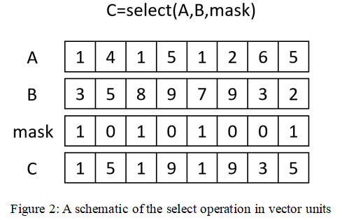
* When a mask bit is 1, the corresponding element is taken from the first source operand vector.

* When a mask bit is 0, the element is selected from the second source operand vector.

As mentioned, due to the limit of the programming model in NPU, the conditional branching vector operations and scalar operations need to be re-implemented as masked vector operation in NPU, as illustrated in the green boxes in Fig. 5. Note that some masks are generated by multiple steps with other auxillary quantities. For instance, the neighbor-swap mask in the second green box in Fig. 5 is obtained as: 
1. Calculate a swap-trial label vector $v_0$, from the random numbers. Each of the element $i$ in $v_0$ can take a value between 0 and $N_{nn}-1$, which is the number of nearest neighbor. (e.g. $N_{nn} = 4$ for the 2D square lattice in Fig. 6). E.g. for two random neighbor-swap vectors of length 10: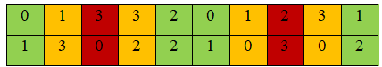, where the numbers indicate which one of the four neighbors to be switched.
2. A mask $m_1$ to select the red atoms in Fig. 1. E.g. 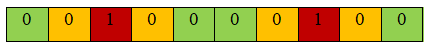.
3. Calculate $N_{nn}$ mask $m_2^i$ for each of the nearest-neighbor site, on the fly, from $v_0$ in step 1. E.g. $m_2^0$: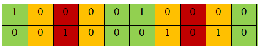
4. For each mask $m_2^i$, do a bit-wise `AND` operation with $m_1$ in step 2 to obtain $m_3^i$. E.g. $m_3^0$: 
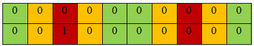, which represents that the site labeled as 1 need to swap with the 0-th neighbor (well, zero-th neighor sounds a little strange, but I suppose the readers understood what I meant).
5. Use the $N_{NN}$ masks $m_3^i$ to construct the swaped lattice vectors.

#### 3. Unified Buffer and Latency Hiding
Another key difference between GPU and NPU is that there is no complete cache hierachy in NPU. Specifically, from Fig. 3, it can be seen that there are global memory and L2 Cache, but no L1 Cache, as would be for the SMs of a GPU. As a result, data movement must be manually tailored to overcoming the gloabl HBM memory bandwidth wall, which is the potential bottleneck of the MC simulation, for both the EPI model and the qSRO model.

As will be discussed in the performance analysis section, the most computing-intensive part is the **calculation of the local energies $E_0$** . As illustrated in Fig. 1, to calculated $E_0$.

Some differences from the GPU that makes optimization more challenging on NPU:
* There are no `INT8` data type, so the atomic species have to be stored at `INT16`, which increase the pressure on the memory, both in size and bandwidth.
* The element selection operation in energy calculaton has to be accomplished by iteration with multiple masks, which can be inefficient compared to GPU, where index selection is straightforward.

Some key considerations for performance optimization on NPU:
* Data contiguous 
* Latency hiding
* Harness the UB to enhance the throughput.
  
Fig. 4 presents a schematic of the energy calculation function in SMC-NPU, based on the 2D square lattice case, for the simplicity of discussion. The vectorization in the local energy calculation is over contiguous local energies $E_0^i$, where $i$ range from 0 to the vector length $L_{VU}$. For instance, for 128-bit vector unit, $L_{VU} = 128/16=8$, as shown in Fig. 4. For the 2048-bit vector unit in NPU, $L_{VU}=2048/16=64$. The number of local energies assigned to each VU (the green sites in Fig. 4) is determined by **maximizing the BU space usage, so that the memeory latency can be hidden.** Different regions of the lattice are assigned to different VUs, as illustrated in Fig. 4. The neighbour information and the chemical environment within LIZ are calculated on-the-fly, as shown in the white sites in Fig. 4. Note that while the information of the local chemical environment are collected from the global memory, the L2 cache can increase the effective throughput.

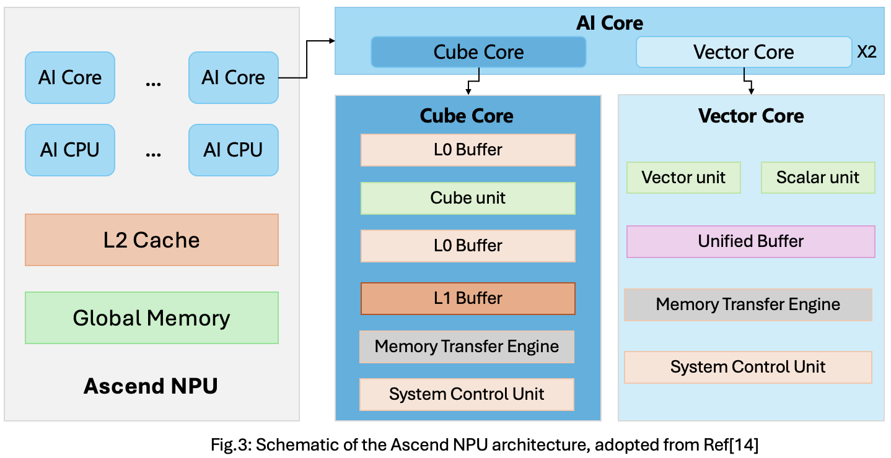

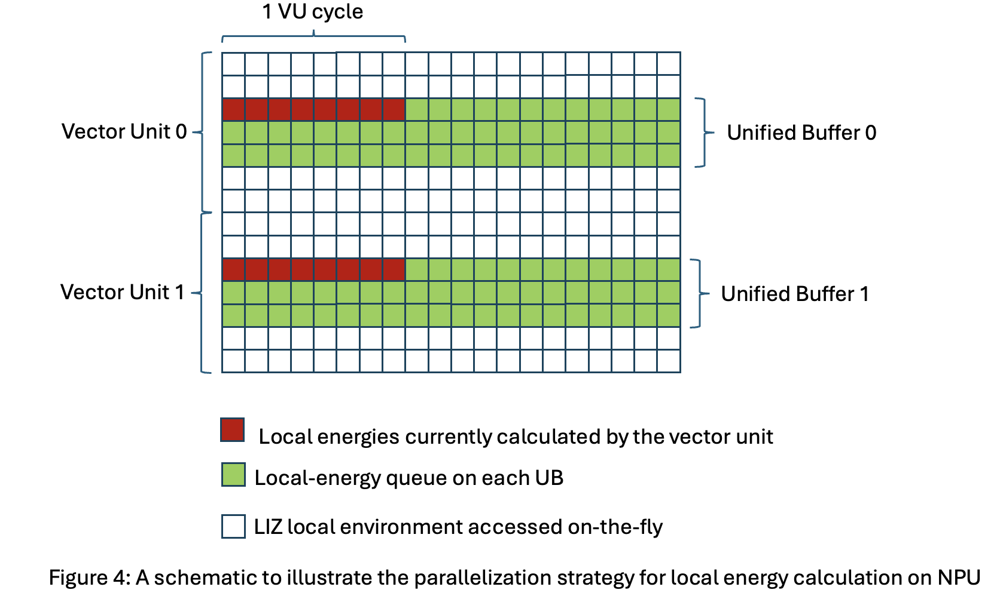

#### Ghost Layers
Another key difference between SMC-NPU and SMC-GPU is on handling the boundary condition in a lattice. On NPU, the atomic virtual layer is used to handle atomic exchanges at periodic boundaries. Periodic boundaries are a technique used to simulate infinitely periodic systems. On GPUs, the atomic virtual layer is not necessary, as GPUs can determine whether the atom being exchanged with a red atom lies on the opposite side of the block and directly read data from that side. However, due to the SIMD (Single Instruction, Multiple Data) architecture of Ascend processors, such conditional checks cannot be implemented efficiently. Therefore, an atomic virtual layer must be introduced, even for the case that the whole lattice supercell is on a single accelerator, and it must be updated after each atomic exchange to ensure **data continuity** during computation. 

#### Performance Analysis
Its obvious that the above steps involves many vector operations. The total number of operations in a MC sweep is approximately proportional to $N*L_{LC}*N_{NN}$, where $N$ is the number of atoms in the lattice, $L_{LC}$ is the length of the link cell. Similarly, for the reduce operation of the local energies to obtain block_energy, the total number of operation in a MC sweep is approximately $N*N_{LIZ}$, where $N_{LIZ}$ is the size of the local interaction zone.

$N*N_{LC}*N_{NN}*L_{LC}$ bit-wise operations

Step 2: Swap
1. Swap;
1. Delta E;
2. Elements on lattice;
3. Write operation combine two lattice 

Diff
1. INT 16 vs INT8
2. Red vs Green;
3. EPI calculation, mask selection, index taken;

###### Energy Computing: cal_energy()
$N*N_{LC}*N_{LIZ}$

* In the SMC-NPU algorithm, the amount of data movement necessary due to the need to calculate the local energy for every sites in every mini-sweep. While in SMC-GPU, only 

#### Results of Distributed SMC-NPU

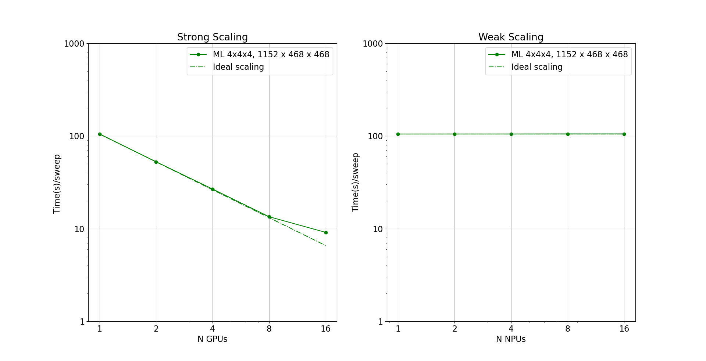